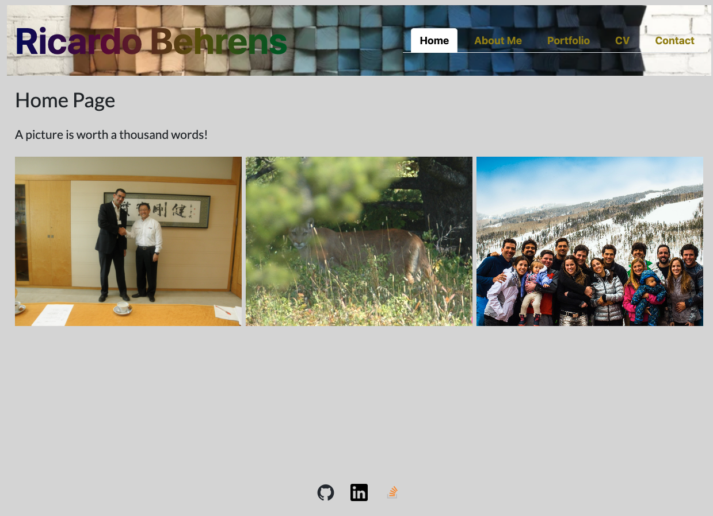
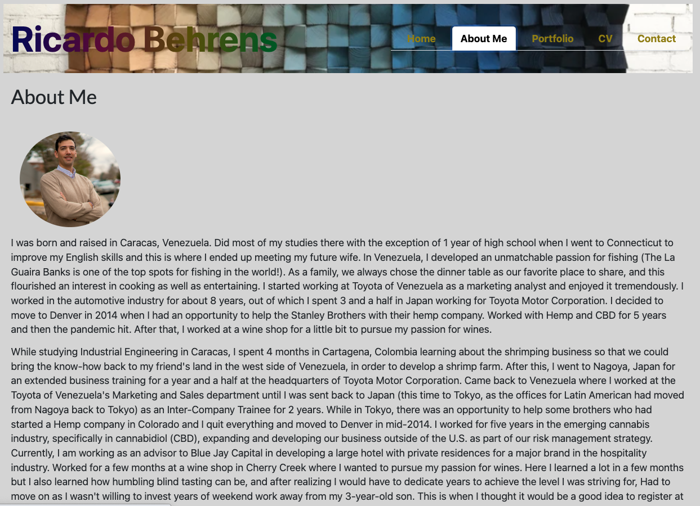
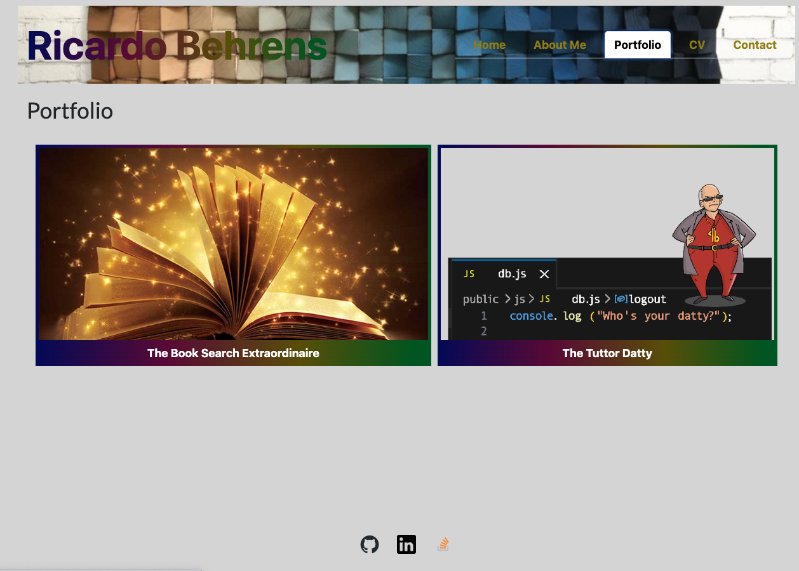
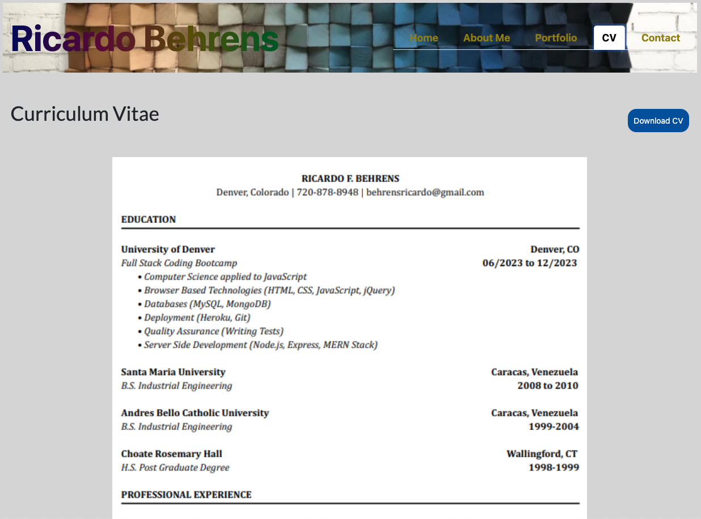
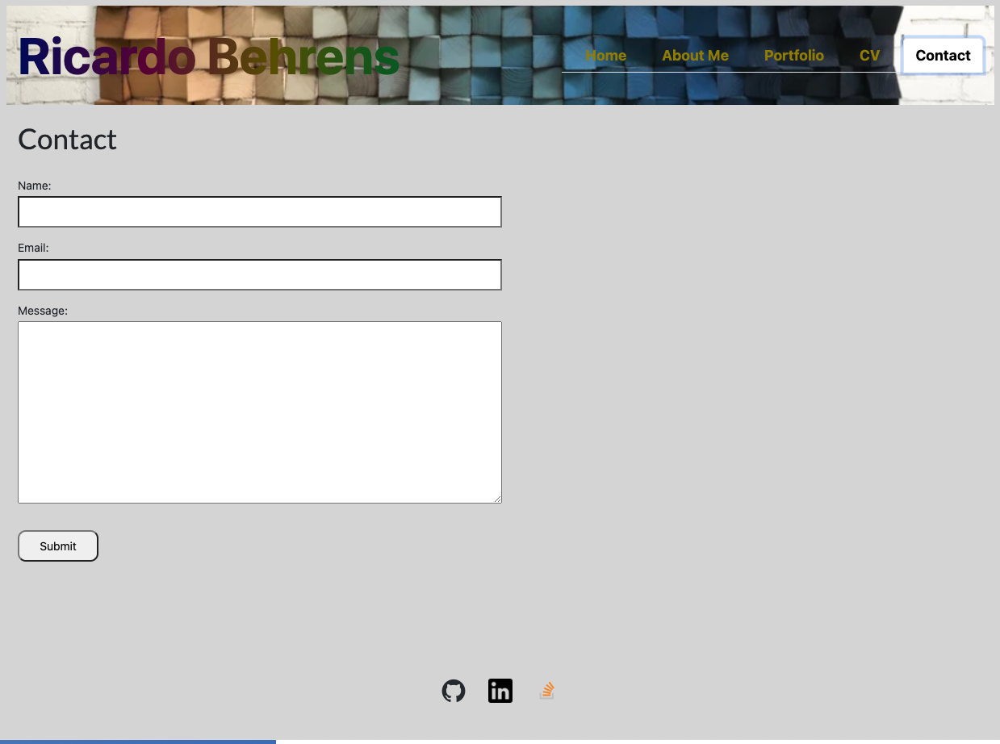

# react-portafolio
[](https://opensource.org/licenses/MIT)
https://github.com/rickybehrens/react-portafolio
https://enchanting-souffle-bf59b8.netlify.app/


## Project Description
I aim to elevate my candidacy by crafting a cutting-edge portfolio showcasing my recently acquired proficiency in React, a contemporary technology. This strategic knowledge distinguishes me from other developers whose portfolios may not include the latest and most sought-after programming tools, technologies and laguages.

## Table of Contents
- [Installation](#installation)
- [Usage](#usage)
- [License](#license)
- [Contributing](#contributing)
- [Questions](#questions)
- [Screenshots](#screenshots)
  
## Installation
To install necessary dependencies, run the following command:
```
npm i
```

  
## Usage
The project involves the development of a comprehensive personal website serving as a dynamic portfolio, bio, and curriculum vitae, strategically designed to enhance my desirability as a candidate in the competitive field of software development. Leveraging my newly acquired React skills, the website stands as a testament to my commitment to staying at the forefront of contemporary technologies. Employers considering my candidacy can seamlessly navigate through a visually appealing and user-friendly interface, gaining insights into my diverse skill set, project experiences, and professional journey. By adopting the latest web development tools, the site not only showcases my technical proficiency but also positions me as a forward-thinking and adaptable developer, ready to contribute effectively to any innovative and technology-driven workplace.

  
## License
This project is licensed under the MIT license.


Copyright (c) 2023 Ricardo Behrens. All rights reserved.


Permission is hereby granted, free of charge, to any person obtaining a copy of this software and associated documentation files (the "Software"), to deal in the Software without restriction, including without limitation the rights to use, copy, modify, merge, publish, distribute, sublicense, and/or sell copies of the Software, and to permit persons to whom the Software is furnished to do so, subject to the following conditions:

The above copyright notice and this permission notice shall be included in all copies or substantial portions of the Software.

THE SOFTWARE IS PROVIDED "AS IS", WITHOUT WARRANTY OF ANY KIND, EXPRESS OR IMPLIED, INCLUDING BUT NOT LIMITED TO THE WARRANTIES OF MERCHANTABILITY, FITNESS FOR A PARTICULAR PURPOSE AND NONINFRINGEMENT. IN NO EVENT SHALL THE AUTHORS OR COPYRIGHT HOLDERS BE LIABLE FOR ANY CLAIM, DAMAGES OR OTHER LIABILITY, WHETHER IN AN ACTION OF CONTRACT, TORT OR OTHERWISE, ARISING FROM, OUT OF OR IN CONNECTION WITH THE SOFTWARE OR THE USE OR OTHER DEALINGS IN THE SOFTWARE.
  
    
## Contributing
If you would like to contribute by have me design a front-end or both fron and back-end website, please reach out and I will gladly develope one for you and add it to my protfolio.

  
## Questions
If you have any questions about the repo, open an issue or contact me directly at [behrensricardo@gmail.com](mailto:behrensricardo@gmail.com). You can find more of my work at [rickybehrens](https://github.com/rickybehrens).

## Screenshots
<!-- Add screenshots here -->





